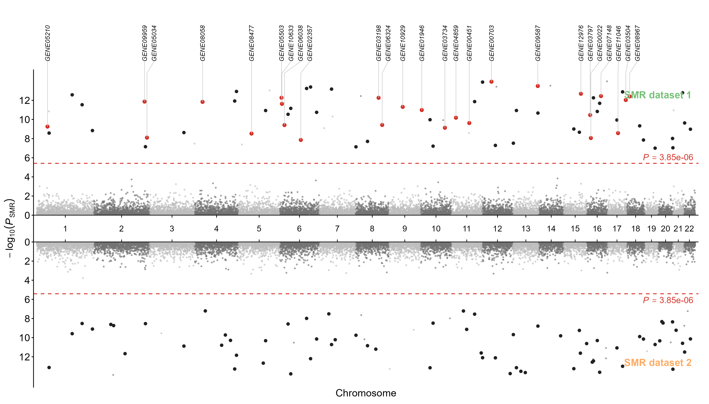

# SMR Miami Plot

`Miami.r` draws a Miami plot for comparing two SMR result sets. The first SMR
file is displayed above the chromosome axis and the second file below it.

The script is intended for direct use with `source()` and is not an R package.





## Requirements

```r
install.packages(c("data.table", "ggplot2"))
```

Load the functions with:

```r
source("miami.r")
```


## Input format

Each input can be:

- a path to an SMR result file;
- a `data.frame`; or
- a `data.table`.

The default column names are:

| Column | Description |
|---|---|
| `probeID` | Probe identifier used to compare signals between the two files |
| `ProbeChr` | Chromosome |
| `Gene` | Gene symbol used for labels |
| `Probe_bp` | Probe genomic position in base pairs |
| `p_SMR` | SMR p-value |
| `p_HEIDI` | HEIDI p-value |

Column names can be changed in `ReadMiamiData()`. A single name is applied to
both inputs; two names can be supplied when the files use different columns.

```r
MiamiData <- ReadMiamiData(
    smr1 = "result_1.smr",
    smr2 = "result_2.smr",
    p.col = c("p_SMR", "SMR_P"),
    gene.col = c("Gene", "Symbol")
)
```


## Quick start

```r
source("miami.r")

MiamiData <- ReadMiamiData(
    smr1 = "result_1.smr",
    smr2 = "result_2.smr",
    heidi.threshold = 0.01,
    smr.alpha = 0.05
)

p <- MiamiPlot(
    data = MiamiData,
    plot.name = c("transSMR", "SMR (mismatch)"),
    highlight = TRUE,
    highlight.text = TRUE
)

print(p)

ggplot2::ggsave(
    "Miami_plot.pdf",
    p,
    width = 14,
    height = 8
)
```


## Signal definition

The two input files are processed separately.

1. `p_SMR` is Bonferroni-adjusted using the number of unique probes in the corresponding file.
2. An SMR signal passes when `p_SMR_adj < smr.alpha`.
3. A signal passes HEIDI when `p_HEIDI > heidi.threshold`.
4. A top-specific signal is a probe that passes both tests in the first file but is absent from the probes passing both tests in the second file.

The plotting styles are:

| Result | Plot style |
|---|---|
| Fails SMR | Chromosome-coloured background point |
| Passes SMR but fails HEIDI | Chromosome-coloured background point |
| Passes both SMR and HEIDI | Solid `signal.col` point |
| Top-specific signal | `highlight.col` point |


## `ReadMiamiData()`

This function reads, standardizes, compares, and prepares the two SMR result
sets.

```r
MiamiData <- ReadMiamiData(
    smr1,
    smr2,
    probe.col = "probeID",
    chr.col = "ProbeChr",
    gene.col = "Gene",
    pos.col = "Probe_bp",
    p.col = "p_SMR",
    heidi.col = "p_HEIDI",
    heidi.threshold = 0.01,
    smr.alpha = 0.05,
    mid.gap = NULL,
    p.min = 1e-300
)
```

| Argument | Default | Description |
|---|---:|---|
| `smr1` | required | First SMR file or data object; plotted on top |
| `smr2` | required | Second SMR file or data object; plotted on bottom |
| `probe.col` | `"probeID"` | Probe ID column; one name or two names |
| `chr.col` | `"ProbeChr"` | Chromosome column; one name or two names |
| `gene.col` | `"Gene"` | Gene column; use `NULL` to label with probe IDs |
| `pos.col` | `"Probe_bp"` | Genomic-position column |
| `p.col` | `"p_SMR"` | SMR p-value column |
| `heidi.col` | `"p_HEIDI"` | HEIDI p-value column; use `NULL` to disable HEIDI filtering |
| `heidi.threshold` | `0.01` | HEIDI passes when `p_HEIDI` is greater than this value |
| `smr.alpha` | `0.05` | Significance level applied to Bonferroni-adjusted SMR p-values |
| `mid.gap` | `NULL` | Central half-gap; `NULL` automatically uses 10% of maximum `-log10(p_SMR)` |
| `p.min` | `1e-300` | Lower p-value bound used before `-log10()` |

The returned `MiamiData` object contains the standardized data, adjusted
p-values, signal classifications, chromosome coordinates, thresholds, and axis
positions required by `MiamiPlot()`.


## `MiamiPlot()`

This function returns a `ggplot` object and does not automatically write a
file.

```r
p <- MiamiPlot(
    data = MiamiData,
    plot.name = c("Top name", "Bottom name")
)
```

### Required arguments

| Argument | Description |
|---|---|
| `data` | Object returned by `ReadMiamiData()` |
| `plot.name` | Two labels corresponding to the top and bottom plots |

### Background and signal points

| Argument | Default | Description |
|---|---:|---|
| `col` | `c("#BDBDBD", "#737373")` | Background colours cycled across chromosomes |
| `cex` | `0.9` | Background-point size |
| `pch` | `16` | Background-point shape |
| `alpha` | `0.65` | Background-point transparency |
| `signal.col` | `"#222222"` | Colour for signals passing both SMR and HEIDI |
| `signal.cex` | `2` | Size of signals passing both tests |

### Highlighting

| Argument | Default | Description |
|---|---:|---|
| `highlight` | `TRUE` | `TRUE` selects automatic top-specific signals; a vector/list selects genes or probes manually; `FALSE` disables highlighting |
| `highlight.by` | `"Gene"` | Match manual values by `"Gene"`, `"probeID"`, or `"both"` |
| `highlight.col` | `"#D73027"` | Highlight-point colour |
| `highlight.cex` | `2` | Highlight-point size |
| `highlight.pch` | `16` | Highlight-point shape |
| `highlight.text` | `TRUE` | Show labels; `FALSE` keeps highlighted points without labels or leader lines |
| `highlight.text.cex` | `1` | Highlight-label size |
| `highlight.text.col` | `"black"` | Highlight-label colour |
| `highlight.text.font` | `3` | Label font: 1 plain, 2 bold, 3 italic, 4 bold italic |
| `max.labels` | `30` | Maximum number of labels, retaining the lowest p-values first; use `Inf` for all |

Highlight labels use the original two-part leader-line layout: a vertical line
rises from the point and then bends towards a vertical gene label above the
plot. Label positions are ordered and spaced automatically along the genomic
axis.

### Thresholds, names, and text

| Argument | Default | Description |
|---|---:|---|
| `threshold.col` | `"#D73027"` | Threshold-line and threshold-text colour |
| `threshold.lty` | `"dashed"` | Threshold-line type |
| `threshold.lwd` | `0.6` | Threshold-line width |
| `threshold.text` | `TRUE` | Display the Bonferroni threshold values |
| `plot.name.col` | `c("#74BF74", "#FFAA60")` | Top and bottom plot-name colours |
| `plot.name.cex` | `1.3` | Plot-name size |
| `chr.cex` | `1.2` | Chromosome-label size |
| `axis.cex` | `1.2` | Y-axis tick-label and threshold-text size |
| `lab.cex` | `1.2` | X/Y-axis title size |
| `title` | `NULL` | Optional plot title |
| `xlab` | `"Chromosome"` | X-axis title |
| `ylab` | `-log10(P_SMR)` expression | Y-axis title |


## Highlight examples

### Automatic top-specific signals with gene labels

```r
p <- MiamiPlot(
    data = MiamiData,
    plot.name = c("transSMR", "SMR (mismatch)"),
    highlight = TRUE,
    highlight.text = TRUE
)
```

### Highlight points without gene labels

```r
p <- MiamiPlot(
    data = MiamiData,
    plot.name = c("transSMR", "SMR (mismatch)"),
    highlight = TRUE,
    highlight.text = FALSE
)
```

### Manually specified genes

```r
p <- MiamiPlot(
    data = MiamiData,
    plot.name = c("transSMR", "SMR (mismatch)"),
    highlight = list(Gene = c("GENE1", "GENE2", "GENE3")),
    highlight.by = "Gene",
    highlight.text = TRUE
)
```

Manual highlights are restricted to the first/top result set.


## Appearance example

```r
p <- MiamiPlot(
    data = MiamiData,
    plot.name = c("Method 1", "Method 2"),
    col = c("#BDBDBD", "#737373"),
    signal.col = "#222222",
    highlight.col = "#D73027",
    highlight.cex = 2.5,
    highlight.text.cex = 1.1,
    plot.name.cex = 1.4,
    chr.cex = 1.3,
    axis.cex = 1.3,
    lab.cex = 1.3
)
```


## Batch plotting

`run_interval_miami.R` is a minimal example for matching and plotting multiple
SMR file pairs:

```bash
Rscript run_interval_miami.R
```

It matches:

```text
*_eQTLeas.smr  -> top plot
*_eQTLeur.smr  -> bottom plot
```

and saves one PDF per matched trait.


## Reproducible simulated example

Generate two 13,000-gene SMR result sets and the example figure with:

```bash
Rscript simulate_smr_example.R
```

The generated files are written to `simulation_output/`.