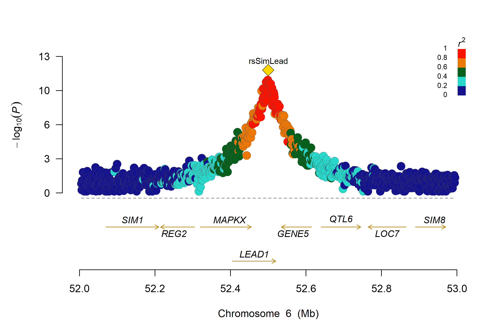
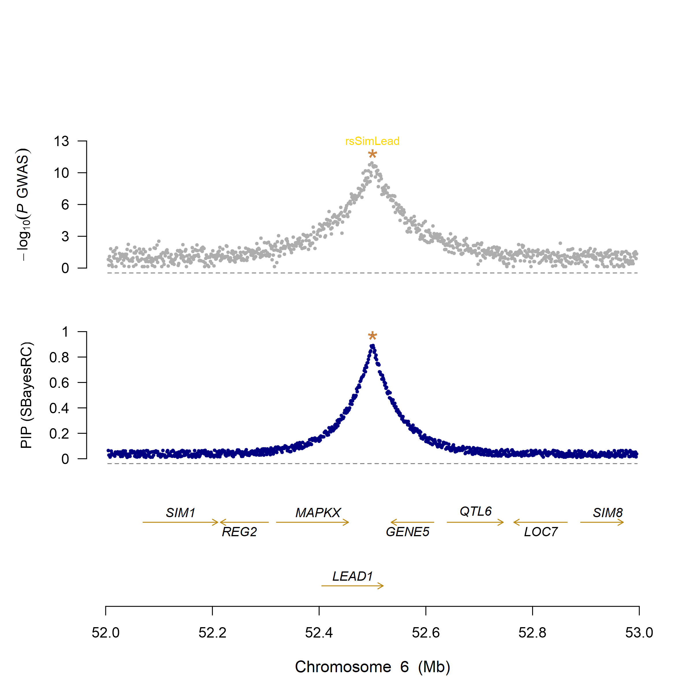
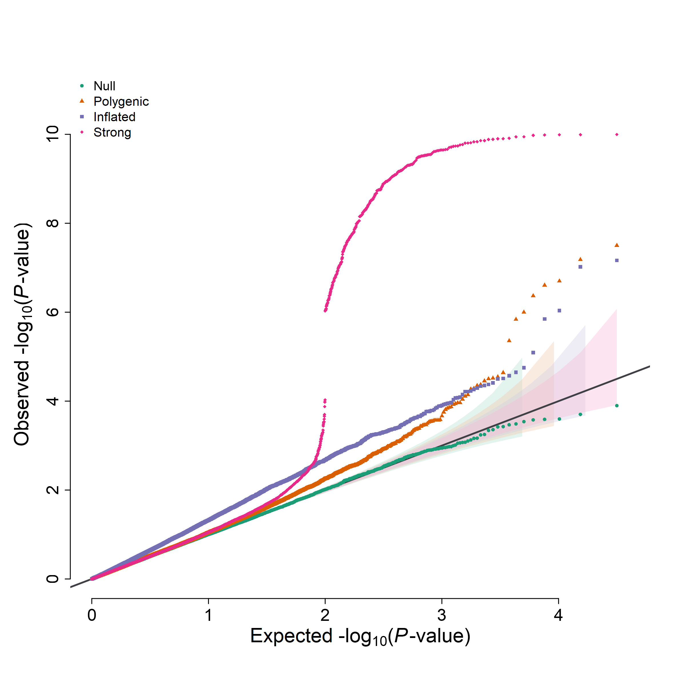
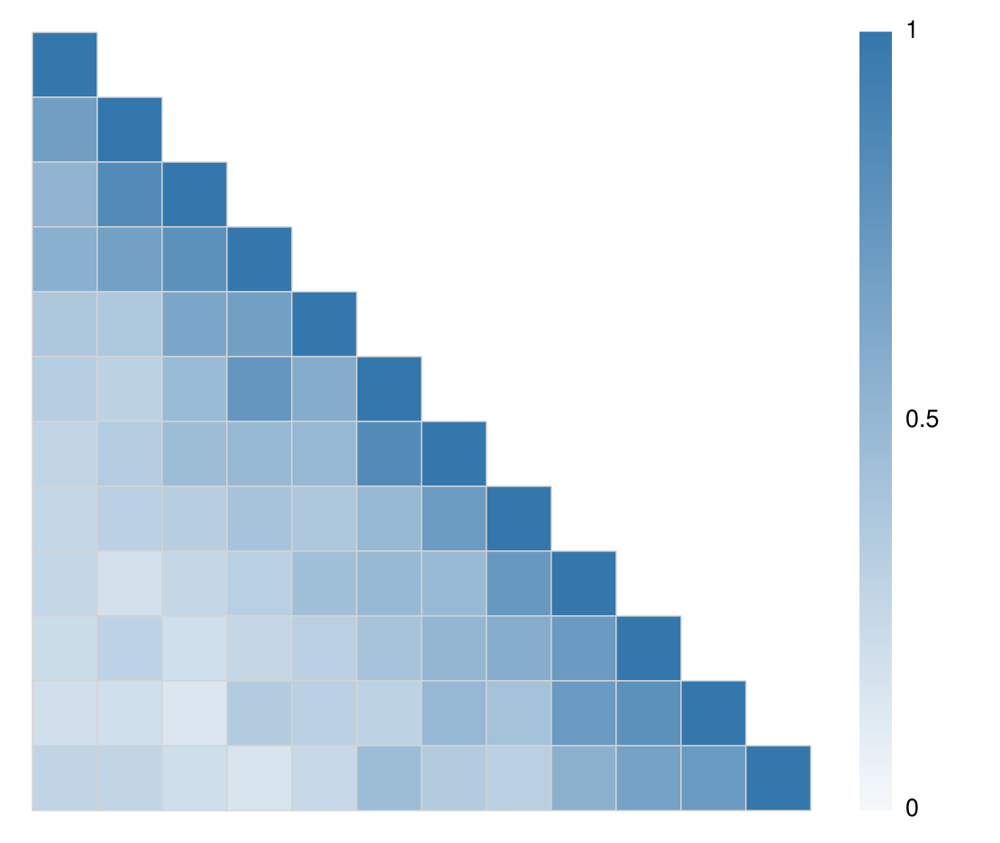

# PhD plotting scripts

## LocusZoom regional plot

Locuszoom plot need user generate the LD info of target region, such as
```bash
# LD info: users can get LD info of target SNP by PLINK, follow cmd can used:
plink --bfile $bfile \
      --ld-snp $snp \
      --ld-window-kb 2000 \
      --ld-window 99999 \
      --ld-window-r2 0 \
      --r2 \
      --out r2_2000kb
```

and the script also need GWAS sums contain following columns: `"CHR" "SNP" "p"`
```r
source("plot_LocusZoom.r")

LZData <- ReadLocusZoomData(
  gwas = "gwas_chrpos.gz",
  ld_info = "plink.ld",
  snp = "rs641221"
)

pdf("locuszoom.pdf", width = 6, height = 4)
plot_locuszoom(data = LZData, genelist = "glist_hg19_refseq.txt")
dev.off()
```

[](plot_LocusZoom.r)

## GWFM plot

GCTB genome-wide fine-mapping regional plot ([GWFM](https://gctbhub.cloud.edu.au/software/gctb/#Genome-wideFine-mappinganalysis) results)

```r
source("plot_GWFM.r")

PData <- ReadPvalueFromFiles(
  gwas = "gwas_chrpos.gz",
  gwfm = "gwaf.snpRes",
  glist = "glist_hg19_refseq.txt",
  windowsize = 200000,
  highlight = "rs641221"
)

pdf("gwfm_plot.pdf", width = 8, height = 8)
MultiPvalueLocusPlot(data = PData)
dev.off()
```

[](plot_GWFM.r)

## Multi-trait QQ plot

```r
source("qqplot_multi.r")
set.seed(20260108)

N <- 30000
p_null <- runif(N)

p_poly <- runif(N)
sig_poly <- rbinom(N, 1, 0.03) == 1
p_poly[sig_poly] <- rbeta(sum(sig_poly), shape1 = 0.4, shape2 = 1)

z_inf <- rnorm(N, mean = 0, sd = 1.2)
p_infl <- 2 * pnorm(-abs(z_inf))

p_strong <- runif(N)
idx_strong <- sample.int(N, size = round(0.01 * N))
p_strong[idx_strong] <- 10^(-runif(length(idx_strong), min = 6, max = 10))

pvals_list <- list(
  Null = p_null,
  Polygenic = p_poly,
  Inflated = p_infl,
  Strong = p_strong
)

png("qqplot_multi.png", width = 2400, height = 2400, res = 300, type = "cairo")
qqplot_multi(
  pvals_list,
  ylim = 11,
  cols = c("#1B9E77", "#D95F02", "#7570B3", "#E7298A"),
  pch = c(16, 17, 15, 18),
  cex = 0.55,
  ci_scale = seq(0.82, 1.0, length.out = 4),
  ci_alpha = 0.35,
  ci_border = FALSE,
  diag_col = "#3F3F46"
)
dev.off()
```

[](qqplot_multi.r)

## LD block simulation

```bash
python ldBlockSim.py \
  --snp-count 12 \
  --color "#3577AC" \
  --seed 20260806 \
  --output-prefix images/ldblock_simulated
```

parameter description:

- `-m, --snp-count`：number of SNPs, min=2, default=10.
- `--color`：LD color, default="#3577AC"。
- `--seed`：seed, for replication
- `-o, --output-prefix`

[](ldBlockSim.py)
